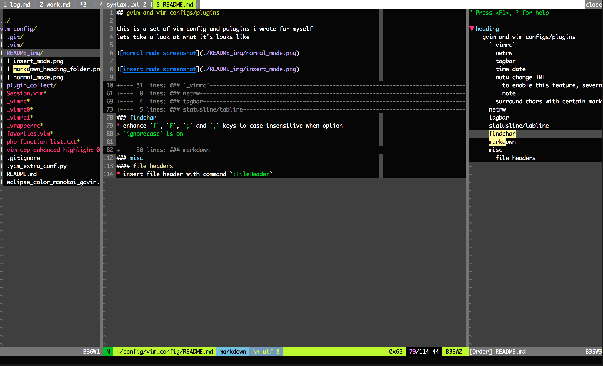
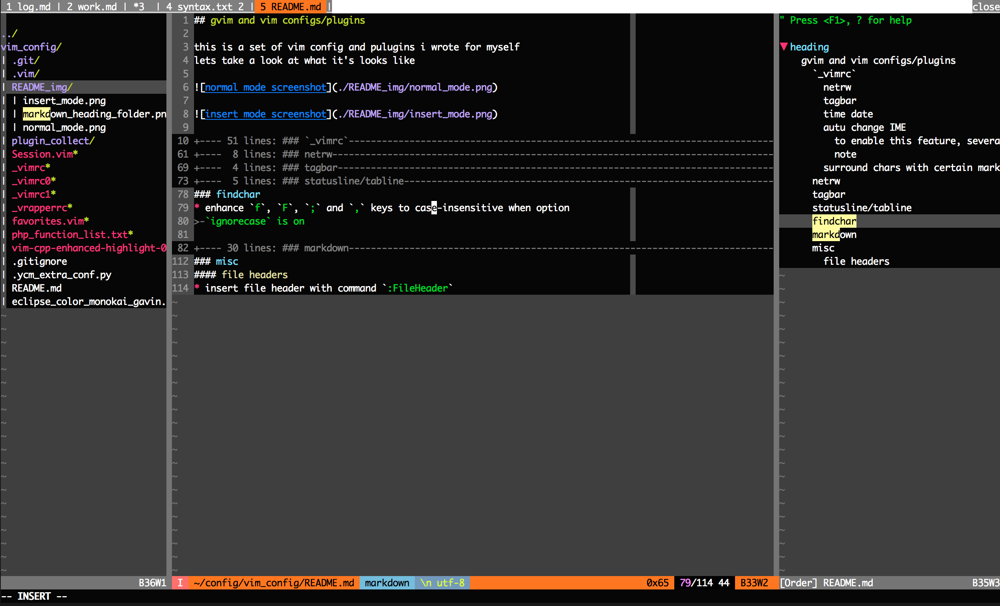
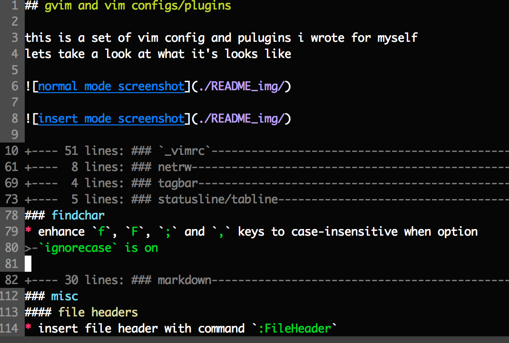

## gvim and vim configs/plugins

### `_vimrc`
this config general options of vim and some plugins
#### netrw
* auto resize netrw window when move cursor between windows
#### tagbar
#### time date
* type `time` in normal mode to insert current time

		2015-10-17-Sat 14:46:02

* type `timelog` in normal mode to insert a time based log template, cursor will
	be set right behind 'tag: '

		## 2015-10-17-Sat 14:45:37
		tag: 

#### autu change IME
this is useful for the users work with different IMEs,
2 platform support, Mac os x and Windows
* auto change IME to Eng when change `insert mode` to `normal mode`
##### to enable this feature, several thins should be done
* windows
	1. install the external util `change_ime_to_eng` for windows, which i offers
		in my repository, see this [link](mylink.com) for more details
	2. make shortcut link of it named `changeVimIme2Eng.lnk`, and put to
		 `%windir%`, say "C:\windows" as usual
	3. enjoy it

* mac os x
	1. `xkbswitch` for mac os x, refer to <xkbswitch.github>
	2. add the path of `xkbswitch` to system evn `PATH`
	3. enjoy it

##### note

only `txt` and `md` files invokes auto change ime feature, to enable this
feature for more filetypes just change the flowing line in `_vimrc`

		autocmd! InsertLeave *.txt,*.md call ChangeIme(g:autoChangeIme)

#### surround chars with certain marks
surround word under cursor or content selected with certain marks with, `F4` in
normal mode or visual mode

say, if a word `abc` is under cursor, in normal mode, press `F4`, a prompt will
ask for mark for surrounding, and, for example, inpput `(`, then `abc` will be
changed to `(abc)`

or, in visual mode, some chars are selected, say `abc def`, press `F4`, and
input the marks for surrounding, say `***`, `abc def` will be changed to
`***abc def***`

### netrw
* display file/dir full path under cursor
* fixed `s:NetrwTreeDir()`'s bugs of moving cursor around after calling it
* create file in current cursor folder with key `c`, if file is under current
	file, create file with the same parent fold of it
* auto change director when move cursor between different folder
* enhance preview with `<CR>`, always open file in preview window with `<CR>`
* auto change netrw cursor position to indicate current file (location) with switch
	g:netrw_indicate_current_file, default on
* fix bug of messing up register `@*` and `@+`

### tagbar
* fixed bugs when use tagbar with netrw, make tagbar process content window
* markdown support
* hilight whole tag line (maybe a switch can be added whether this function is
	enabled)

### statusline/tabline
* make statusline change color locally when mode changes
* tabline will change as statusline changes color (mode stimulated)

### findchar
* enhance `f`, `F`, `;` and `,` keys to case-insensitive when option
	`ignorecase` is on

### markdown
* auto folder contents with the same headings levels

* 
	align markdown table with ranged based command `:Table`

	that is 

	1. select markdown tables
	2. input `:Table`, with which `:'<,'>Table` will appear

	example:

		before:

			header1|header2|header3
			-----|-----|-----
			aaa|b\|bb|cc
			dd|eeeee|ffffff

		after:

			header1|header2|header3
			-----  |-----  |-----
			aaa    |b\|bb  |cc
			dd     |eeeee  |ffffff

		note: this plugin has capability with '\|', skips escaped '|'

### code/text format
* as [previous](#markdownTable), align with given character is supported with
	ranged command `Align`
	
	example:

	orignal text:

		int a = 10;
		int aa = 100;
		int aaa = 1000;
		int aaaa = 10000;
		int aaaaa = 100000;

	select it and use command `:'<,'>Align =`

		int a     = 10;
		int aa    = 100;
		int aaa   = 1000;
		int aaaa  = 10000;
		int aaaaa = 100000;

	select it and use command `:'<,'>Align ;`
	
		int a = 10        ;
		int aa = 100      ;
		int aaa = 1000    ;
		int aaaa = 10000  ;
		int aaaaa = 100000;

	**note: this function is very insteresting, use your imagination!!!**

	take a look at `.vim/plugin/align.vim`

### misc
#### file headers
* insert file header with command `:FileHeader`
